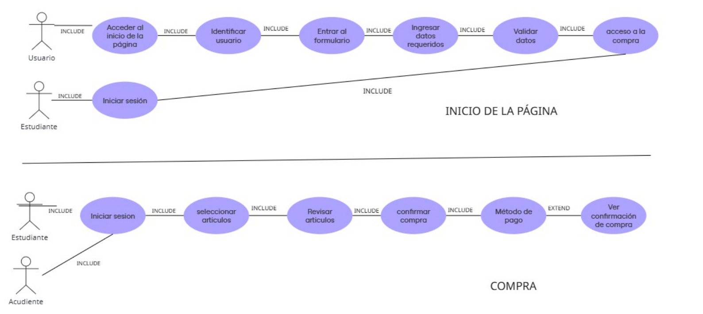
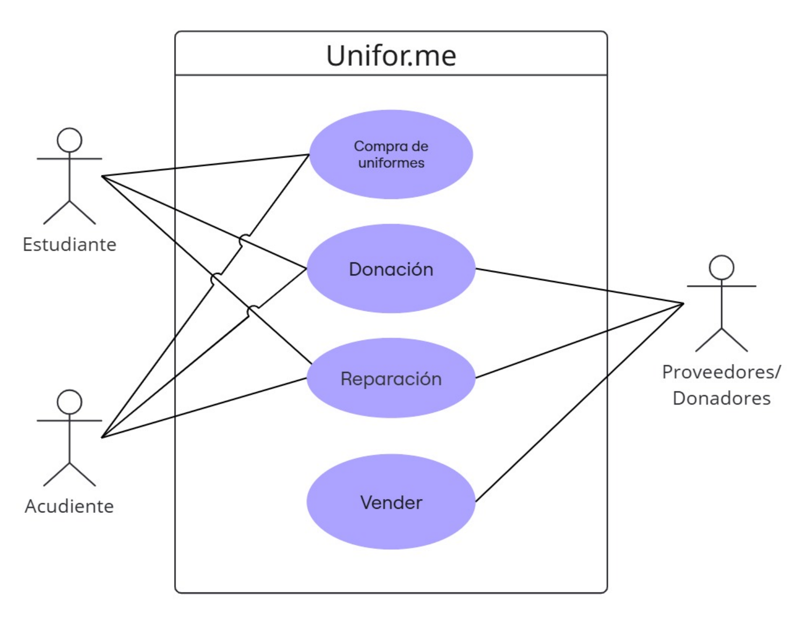
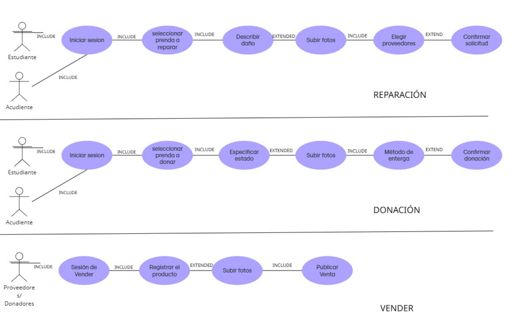
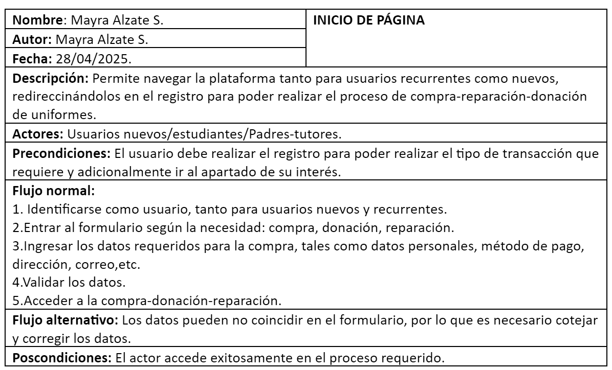
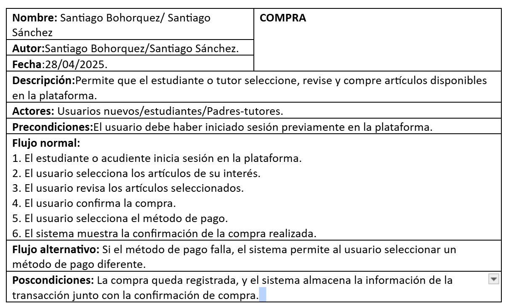
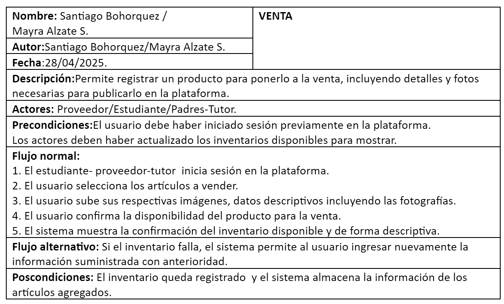
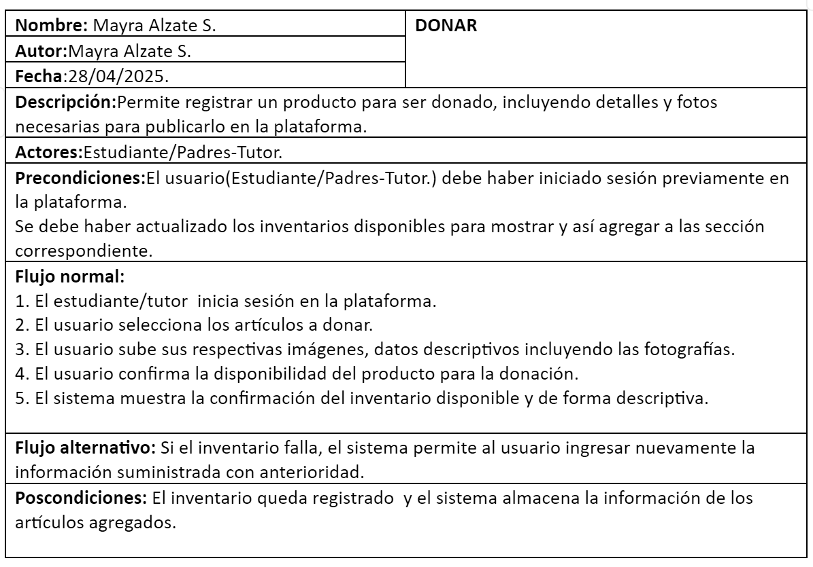
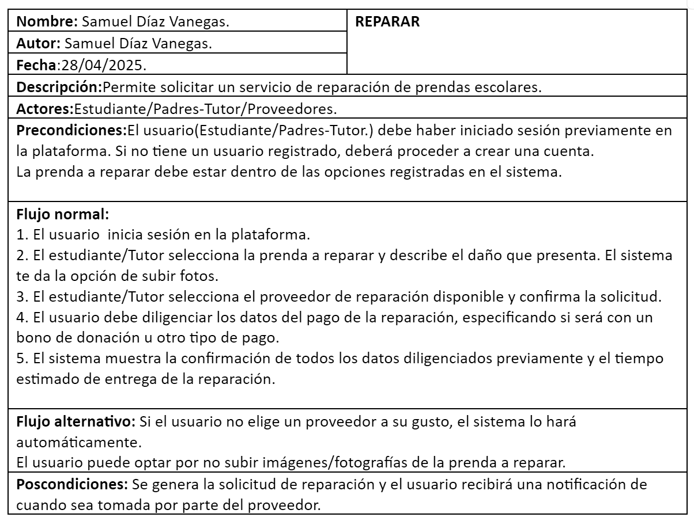
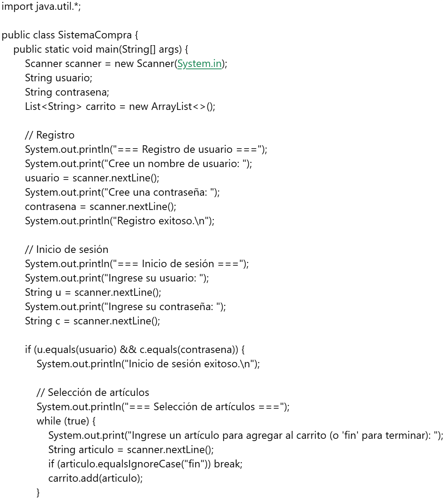
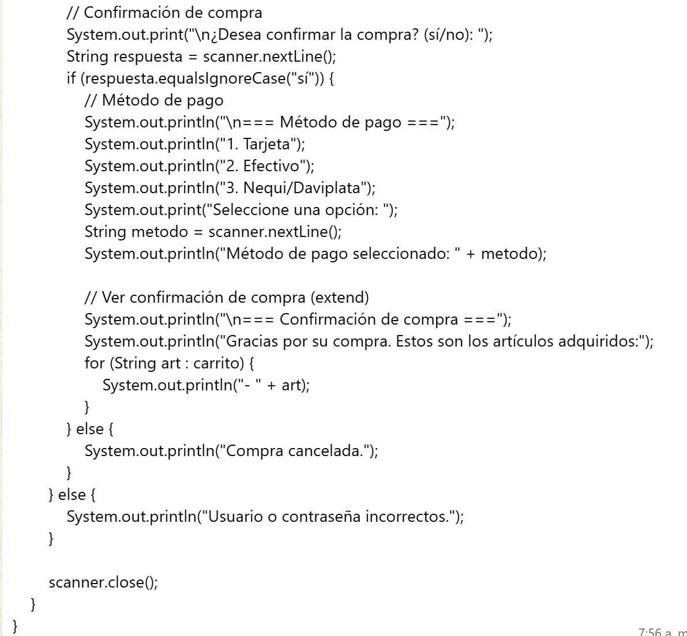

# Unifor.me

Unifor.me es una plataforma que permite la adquisición y/o el intercambio de uniformes escolares en las IEs del área metrolitana del Valle de Aburrá. 
El objetivo es el de generar entornos donde el aprendizaje no se vea afectado por factores como el no tener distracciones de cuenta de la vestimenta por lo cual se plantea una opción para adquirir los uniformes, donarlos y hasta repararlos, dado sea  el caso.

## ¿Cómo funciona?

Para el uso de la plataforma debes tener una cuenta o registrarte para así acceder a las diferentes opciones planteadas para los diferentes actores como proveedores, estudiantes y/o tutores.

## Página de inicio

En esta sección, se dispone a dar la información principal del proyecto y desde la cual se redirige a los diferentes apartados disponibles.

También encontrarás un carrusel donde se muestra información relevante a tener en cuenta para una mejor experiencia de usuario, tales como los tiempos de entrega, incentivo a donar, entre otros.

Podrás encontrar también un formulario en caso de tener alguna inquietud; en su defecto también estan disponibles las redes sociales, correo electrónico o línea telefónica para mayor información.

# Metodologías aplicadas

Empleamos las siguientes metodologías para la implementación del proyecto:

## Metodología Scrum:

Definimos los roles a ejecutar para desplegar el proyecto y optimizar los tiempos de trabajo de forma más eficiente.

- Scrum master. 
- Product owner.
- Equipo de desarrollo.

Todos los miembros del equipo han  estado ejerciendo cada uno de los roles de la metodología,como resultado de la flexibilidad que nos brinda la metodología para obtener mejores resultados en cada uno de los sprints llevados a cabo.

##  Metodología Kanban:

Con la ayuda de la plataforma de Trello, distribuimos tareas pendientes, en proceso y terminadas.

Cada integrante tiene a cargo tareas específicas que se diferencian por colores asignados respectivamente.

## Diagramas de flujo y casos de uso:

Se establecieron estos diagramas como soporte para el desarrollo del código en Java. 

Se identificaron 5 acciones relevantes y se desarrolló el paso a paso para desglosar las respectivas funciones a plantear en cada consola.

- Diagramas de flujo:

- Casos de uso:

## Lógica de programación:

Apoyándonos en los diagramas de flujo y los casos de uso, se procedió a plantear el código inicialmente para creación de consolas que capturen los datos inicialmente. 

A futuro, se empleará la herramienta de ***Vaadin*** para desarrollar una aplicación más limpia y con el uso de botones para la etapa final del proyecto integrador.

A continuación se evidenciará el código que se ha construido y que eventualente estará inicializado con un método main y métodos alternos para la creación de un menú dentro del IDE de ***Studio Visual Code***.

## ***NOTA***:

El proyecto está en su segunda fase por lo cual aún esta en construcción por lo que eventualmente se presentarán cambios.

## Grupo de trabajo:

- [@Malzate1](https://www.github.com/malzate1): Mayra Alejandra Alzate.
- [@zamu5555](https://www.github.com/zamu5555) : Samuel Díaz Vanegas.
- [@Elgrinch001](https://www.github.com/Elgrinch001) : Santiago Bohorquez Saldaña.
- [@piolin666satan](https://www.github.com/piolin666satan): Santiago Sánchez Rojas.